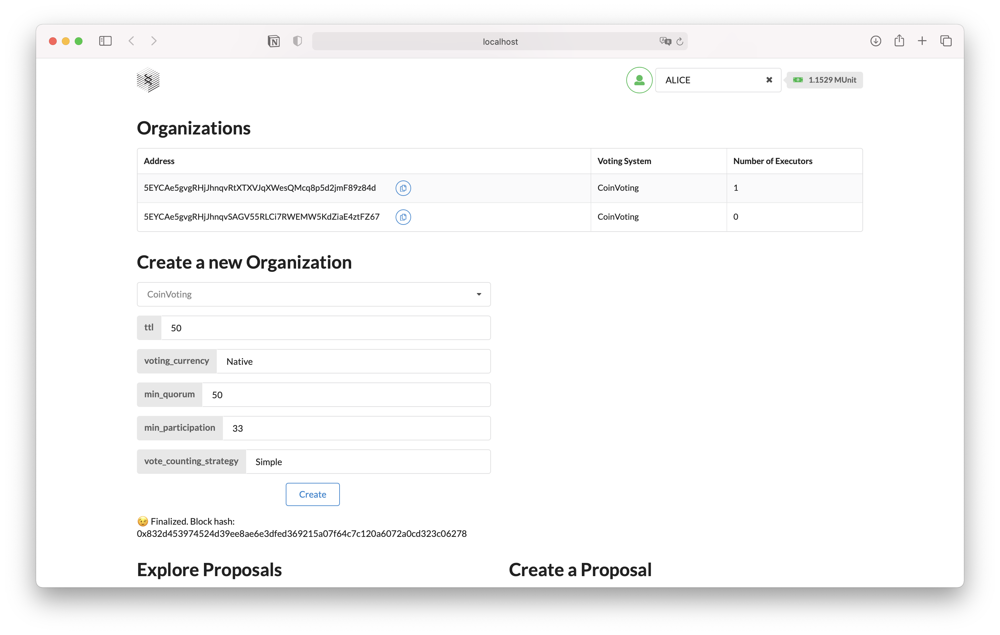
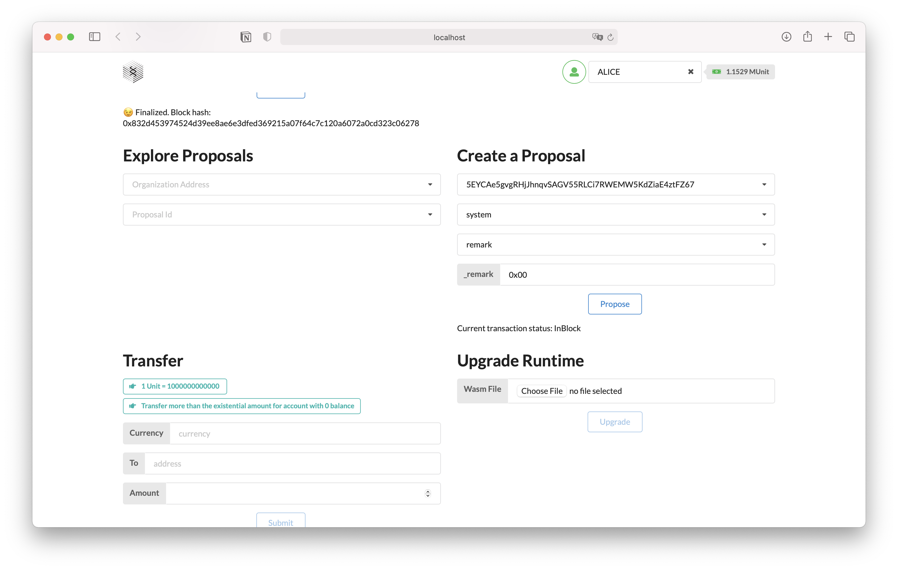
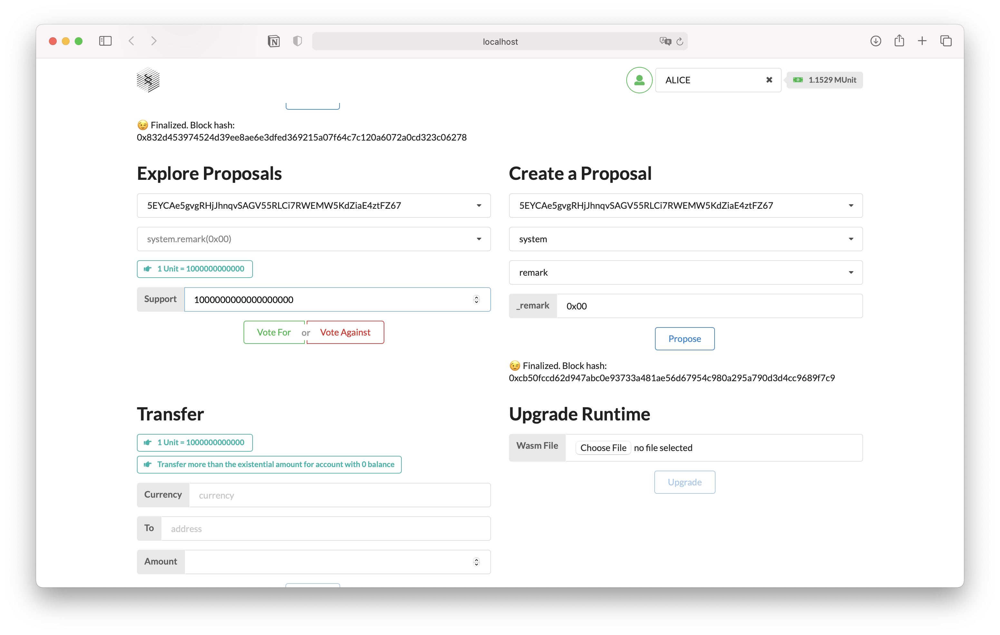
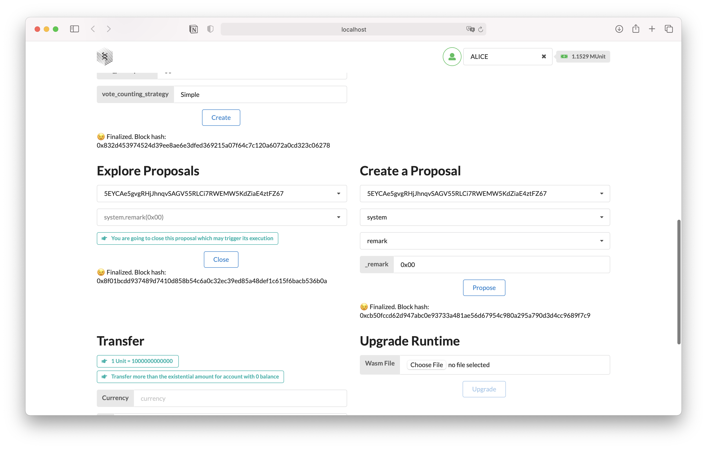
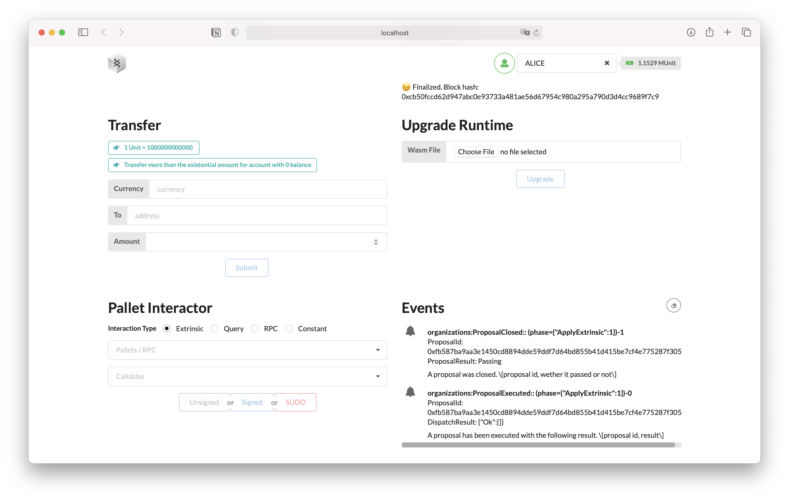

# Milestone 3 Testing

Milestone 3 covered the development of a web based frontend application to interact with the Governance OS node provided over the course of the previous milestones. It is based atop the `Substrate Frontend Template`, we have added custom components to it and modified a few of the existing ones.

## Requirements
You will need a few things first:
1. A running local node, the easiest way to create one is to use this command: `docker run --rm -p 9944:9944 -it eteissonniere/governance-os --dev --tmp --ws-external --rpc-cors all` or run the command `cargo run -- --dev --tmp --rpc-cors all` in this repository.
2. A locally running copy of the frontend server, the easiest way to do so is to navigate to the `app` folder and run the command `yarn && yarn start`.

## Testing
### Create an organization
In order to create an organization you can navigate to the `Create a new Organization` tab, and fill the form fields accordingly:
1. The first field is a dropdown which should propose you to create an organization with one of the three voting models we support. In our case we chose `CoinVoting`.
2. After selecting your voting model, new fields should show up to allow you to configure your new organization. In our case we have the ones for the `CoinVoting` voting system:
   1. `ttl` is set to the arbitrary value of 50. This leaves us with `150` seconds to vote for a proposal before it expires and should be enough for testing purposes.
   2. We set `voting_currency` to `Native`, this means that the organization will use the default chain currency to represent votes and weights. If we had created an alternative token we could specify it here.
   3. We set `min_quorum` to `50` as usual.
   4. We set `min_participation` to `33` as usual.
   5. We set `vote_counting_strategy` to `Simple`, although we could have used `Quadratic` as well. For more details the vote counting strategy we would recommend to check the Wave 9 Milestone 1 testing instructions.
3. We then click the `Create` button, the transaction status should be updated below and the appropriate event should be triggered and show up in the `Event` tab.
4. 2 seconds later, the new organization should appear in the `Organizations` tab, in our case its address is `5EYCAe5gvgRHjJhnqvSAGV55RLCi7RWEMW5KdZiaE4ztFZ67`.

### Create a proposal
Now that the organization was created we can navigate to the `Create a Proposal` tab. We then select our new organization (`5EYCAe5gvgRHjJhnqvSAGV55RLCi7RWEMW5KdZiaE4ztFZ67`) and select which kind of extrinsic we want to propose. In our system we chose our usual `system.remark(0x00)`. Don't forget to click `Propose`!

### Cast some votes
Now is the time to vote for or against our proposal! By default, the interface is set to use the `ALICE` account by default so this is the account we will use to submit the votes from.

1. Navigate to the `Explore Proposals` tab.
2. Select your organization via its address.
3. You should see the next dropdown gets populated with the proposals available, in our case we see `system.remark(0x00)` which matches what we had submitted.
4. We are then asked for a `Support` value. Due to how Substrate manages numbers we have to fill it as the smallest decimal supported. In our case we want to vote with 1 Million of Alice's coins so we use the `1000000000000000000` value.
5. We can then click wether we are voting for or against the proposal.

> **Note**: if you have selected a different voting system the UI here may be a bit different. For instance, for PLCR voting we have to first submit a `Commit` vote followed by a `Reveal` vote, and the UI reflects this approprietaly. Give it a try!

### Close and execute the proposal
Now is time to close the proposal. The UI is able to detect wether we can close the proposal early or if it expired and will react appropriately.

In our case, we voted for the proposal with so many coins that it will pass when closed. This is why the UI switches to the closing form early.

Let's go ahead and press the `Close` button! The UI should display the transaction status approprietaly, additionnally if you go to the `Event` tab you should some logs displayed there (in our case, we get the `ProposalExecuted` event because we voted for the proposal).

