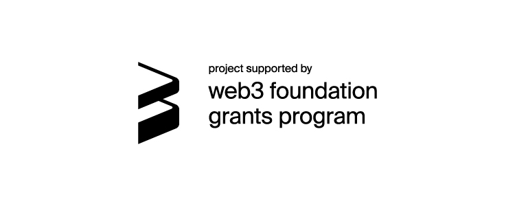

# Governance OS
The Governance OS is a set of pallets that can be used to allow the users of a Parity Substrate runtime to create fully customizable, decentralized, autonomous organizations.

**[Browse the Documentation](https://nucleistudio.github.io/governance-os/governance_os_node/index.html)**



# For Developers

## Rust Setup
> If you do not have Rust installed simply install it via `curl https://sh.rustup.rs -sSf | sh`.

Our repo contains a [`rust-toolchain`](rust-toolchain) file so that `cargo` automatically selects the right version of rust to build the project without any issues. However, you still need to setup your toolchain to support Web Assembly builds, to do so, simply run the helper script:
```
./scripts/init.sh
```

## Dependencies
Depending on your system, you may have to install a few packages and libraries for everything to work fine.

> In case of any issues you may find the [Substrate Informations](https://substrate.dev/docs/en/knowledgebase/getting-started/) useful.

### For Mac (with [brew](https://brew.sh))
```
brew update
brew install openssl cmake
```

### For Debian / Ubuntu based systems
```
sudo apt update
sudo apt install -y cmake pkg-config libssl-dev git build-essential clang libclang-dev curl
```

### For Arch Linux
```
pacman -Syu --needed --noconfirm cmake gcc openssl-1.0 pkgconf git clang
export OPENSSL_LIB_DIR="/usr/lib/openssl-1.0"
export OPENSSL_INCLUDE_DIR="/usr/include/openssl-1.0"
```

## Testing
You can easily run our unit testing suite via the following command:
```
cargo test --all
```

## Documenting
You can easily generate and open our code documentation via the following command:
```
cargo doc --open
```

Alternatively, you can access it [online](https://nucleistudio.github.io/governance-os/governance_os_node/index.html).

## Building
The easiest way to build the project is via the following command:
```
cargo build -p governance-os-node
```

## Running
You can run a freshly build development (and ephemeral) node via:
```
cargo run -- --dev --tmp
```

You should be able to interact with it via the [Polkadot JS Interface](https://polkadot.js.org/apps/?rpc=ws%3A%2F%2F127.0.0.1%3A9944#/explorer). You may need to register some custom developer types though, to do so, head over to "Settings", then "Developer" and copy paste the content of the [types.json](types.json) file. Finally, click save and reload the page.